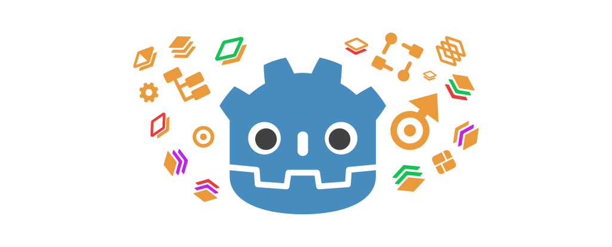
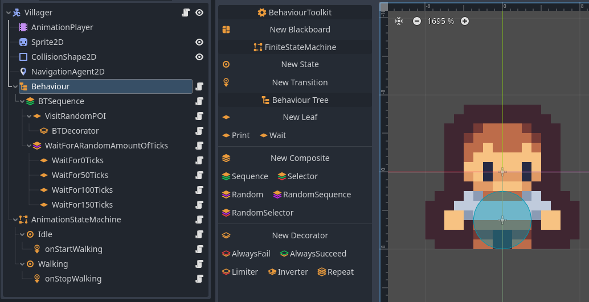

# BehaviourToolkit

This plugin provides a set of tools to create custom and complex behaviour in the Godot 4.x Game Engine.

    
    
    
        
    
    
    
    
    
    
    
    
    
    
    
    
    

### Features
-  Behaviour Architectures
    -  Finite State Machine
    -  Behaviour Tree
    -  Nest Behaviour Trees inside State Machines and vice versa!
-  Blackboard Resource
- Editor Interface
- [Templates](docs/documentation.md#using-script-templates) for easy extension and integration.
- Example Scene

## Usage
Make sure the clones the `addons` and `script_templates` directories into your project.

1. Add a `FiniteStateMachine` or `BTRoot` node to your scene.
2. A toolbox will appear in the editor, allowing you to add behaviour nodes to the scene.
3. Setup and configure your behaviour nodes in the inspector.
4. Right-click your `FSMState`/`FSMTransition`/`BTLeaf` and extend the script.

Now you can implement your own behaviour logic using the virtual methods provided by the script templates.

## Documentation
- [Documentation](docs/documentation.md)
  -   [Finite State Machine](docs/documentation.md#finite-state-machine)
  -   [Behaviour Tree](docs/documentation.md#behaviour-tree)
  -   [Blackboard](docs/documentation.md#-blackboard)
  -   [Nesting Behaviours inside Behaviours](docs/documentation.md#nesting-behaviours-inside-behaviours)
  

## Notes 
This is the first time I've ever made a bigger plugin for Godot, so I am happy for any suggestions, feedback and contributions. If you need help or have any questions, feel free to contact me on Discord (`thepat02`) or open an issue on GitHub!

You can also [buy me a coffee](https://ko-fi.com/pat02) if you like the plugin and feel like supporting me :D

Have fun creating awesome behaviours!
